# 📊 ESTRUCTURA COMPLETA DE LA BASE DE DATOS
## Sistema de Uniformes Winston Churchill

---

## 📈 RESUMEN EJECUTIVO

**Total de tablas:** 29 tablas principales

**Categorías:**
- 👥 **Usuarios y Autenticación:** 2 tablas
- 🏪 **Multi-Sucursal:** 4 tablas  
- 👕 **Catálogo de Productos:** 5 tablas
- 📦 **Pedidos y Ventas:** 4 tablas
- 🔄 **Devoluciones:** 2 tablas
- 📋 **Cotizaciones:** 2 tablas
- 🧵 **Insumos y Producción:** 4 tablas
- 💰 **Finanzas:** 2 tablas
- 🔒 **Auditoría e Integridad:** 3 tablas (NUEVO)
- 📚 **Configuración:** 1 tabla (NUEVO)

---

## 📋 LISTADO COMPLETO DE TABLAS

### 1. USUARIOS Y AUTENTICACIÓN (2)
1. **usuario** - Usuarios del sistema (tabla real en BD)
2. **usuarios** - Tabla auxiliar del schema (deprecada, usar `usuario`)

### 2. MULTI-SUCURSAL (4)
3. **sucursales** - Catálogo de sucursales
4. **transferencias** - Transferencias de mercancía entre sucursales
5. **detalle_transferencias** - Detalle de prendas transferidas
6. **devoluciones** - Registro de devoluciones
7. **detalle_devoluciones** - Detalle de artículos devueltos

### 3. CATÁLOGO DE PRODUCTOS (5)
8. **categorias_prendas** - Categorías de prendas
9. **prendas** - Catálogo de prendas
10. **tallas** - Catálogo de tallas
11. **costos** - Precios y stock por prenda-talla-sucursal
12. **movimientos** - Movimientos de inventario

### 4. CLIENTES Y PEDIDOS (4)
13. **alumnos** - Catálogo de alumnos
14. **externos** - Catálogo de clientes externos
15. **pedidos** - Pedidos de venta
16. **detalle_pedidos** - Detalle de prendas por pedido

### 5. COTIZACIONES (2)
17. **cotizaciones** - Cotizaciones generadas
18. **detalle_cotizacion** - Partidas de cada cotización

### 6. INSUMOS Y PRODUCCIÓN (4)
19. **presentaciones** - Unidades de medida para insumos
20. **insumos** - Catálogo de insumos/materiales
21. **compras_insumos** - Compras de insumos
22. **prenda_talla_insumos** - Relación prenda-talla-insumo (receta)

### 7. FINANZAS (2)
23. **cortes** - Cortes de caja
24. **detalle_cortes** - Detalle de pedidos por corte

### 8. AUDITORÍA E INTEGRIDAD (3) ✨ NUEVO
25. **auditoria** - Registro de cambios críticos (INSERT/UPDATE/DELETE)
26. **snapshot_insumos_pedido** - Historial de recetas por pedido (preserva receta original)
27. **mv_ventas_por_sucursal** - Vista materializada para reportes rápidos por sucursal

### 9. CONFIGURACIÓN (1) ✨ NUEVO
28. **ciclos_escolares** - Catálogo de ciclos escolares (2003=0, 2025=22)

---

## 🗺️ DIAGRAMA DE RELACIONES (ERD)

```mermaid
erDiagram
    %% USUARIOS Y AUTENTICACIÓN
    usuario {
        smallserial usuario_id PK
        varchar usuario_username UK
        varchar usuario_password
        varchar usuario_email
        smallint usuario_status
        smallint perfil_id FK
    }

    %% MULTI-SUCURSAL
    sucursales {
        uuid id PK
        varchar codigo UK
        varchar nombre
        text direccion
        varchar telefono
        boolean es_matriz
        boolean activo
    }

    transferencias {
        uuid id PK
        varchar folio UK
        uuid sucursal_origen_id FK
        uuid sucursal_destino_id FK
        smallint usuario_id FK
        varchar estado
        text observaciones
    }

    detalle_transferencias {
        uuid id PK
        uuid transferencia_id FK
        uuid prenda_id FK
        uuid talla_id FK
        integer cantidad
    }

    devoluciones {
        uuid id PK
        serial folio UK
        uuid pedido_id FK
        uuid sucursal_id FK
        smallint usuario_id FK
        varchar tipo_devolucion
        varchar motivo
        decimal total_devolucion
        boolean reembolso_aplicado
        varchar estado
    }

    detalle_devoluciones {
        uuid id PK
        uuid devolucion_id FK
        uuid prenda_id FK
        uuid talla_id FK
        integer cantidad_devuelta
        decimal precio_unitario
        boolean es_cambio
        uuid prenda_cambio_id FK
        uuid talla_cambio_id FK
    }

    %% CATÁLOGO
    categorias_prendas {
        uuid id PK
        varchar nombre UK
        boolean activo
    }

    prendas {
        uuid id PK
        varchar nombre
        varchar codigo UK
        text descripcion
        uuid categoria_id FK
        boolean activo
    }

    tallas {
        uuid id PK
        varchar nombre UK
        integer orden
        boolean activo
    }

    costos {
        uuid id PK
        uuid prenda_id FK
        uuid talla_id FK
        uuid sucursal_id FK
        decimal precio_venta
        integer stock
        integer stock_inicial
        integer stock_minimo
        decimal precio_mayoreo
        decimal precio_menudeo
        boolean activo
    }

    movimientos {
        uuid id PK
        varchar tipo
        uuid costo_id FK
        integer cantidad
        text observaciones
        uuid usuario_id FK
    }

    %% CLIENTES
    alumnos {
        uuid id PK
        varchar nombre
        varchar referencia UK
        varchar grado
        varchar grupo
        varchar telefono
        varchar email
        boolean activo
    }

    externos {
        uuid id PK
        varchar nombre
        varchar telefono
        varchar email
        text direccion
        boolean activo
    }

    %% PEDIDOS
    pedidos {
        uuid id PK
        uuid alumno_id FK
        uuid externo_id FK
        varchar tipo_cliente
        uuid sucursal_id FK
        varchar estado
        decimal subtotal
        decimal total
        timestamp fecha_entrega
        timestamp fecha_liquidacion
        text notas
        uuid usuario_id FK
    }

    detalle_pedidos {
        uuid id PK
        uuid pedido_id FK
        uuid prenda_id FK
        uuid talla_id FK
        integer cantidad
        decimal precio_unitario
        decimal subtotal
        integer pendiente
        text especificaciones
    }

    %% COTIZACIONES
    cotizaciones {
        uuid id PK
        varchar folio UK
        uuid alumno_id FK
        uuid externo_id FK
        varchar tipo_cliente
        date fecha_cotizacion
        date fecha_vigencia
        decimal subtotal
        decimal total
        text observaciones
        varchar estado
        uuid usuario_id FK
    }

    detalle_cotizacion {
        uuid id PK
        uuid cotizacion_id FK
        varchar prenda_nombre
        varchar talla
        varchar color
        text especificaciones
        integer cantidad
        decimal precio_unitario
        decimal subtotal
    }

    %% INSUMOS
    presentaciones {
        uuid id PK
        varchar nombre UK
        text descripcion
        boolean activo
    }

    insumos {
        uuid id PK
        varchar codigo UK
        varchar nombre
        text descripcion
        uuid presentacion_id FK
        decimal cantidad_por_presentacion
        integer stock_minimo
        boolean activo
    }

    compras_insumos {
        uuid id PK
        uuid insumo_id FK
        decimal cantidad_comprada
        decimal costo_unitario
        decimal costo_total
        varchar proveedor
        date fecha_compra
        text notas
        uuid usuario_id FK
    }

    prenda_talla_insumos {
        uuid id PK
        uuid prenda_id FK
        uuid talla_id FK
        uuid insumo_id FK
        decimal cantidad
    }

    %% FINANZAS
    cortes {
        uuid id PK
        date fecha_inicio
        date fecha_fin
        decimal total_ventas
        integer total_pedidos
        uuid usuario_id FK
        boolean activo
    }

    detalle_cortes {
        uuid id PK
        uuid corte_id FK
        uuid pedido_id FK
    }

    %% RELACIONES

    %% Sucursales
    transferencias ||--|| sucursales : "origen"
    transferencias ||--|| sucursales : "destino"
    transferencias ||--o| usuario : "registra"
    detalle_transferencias }o--|| transferencias : "pertenece"
    detalle_transferencias }o--|| prendas : "contiene"
    detalle_transferencias }o--|| tallas : "tiene"

    devoluciones }o--|| pedidos : "devuelve"
    devoluciones }o--|| sucursales : "en"
    devoluciones }o--o| usuario : "registra"
    detalle_devoluciones }o--|| devoluciones : "pertenece"
    detalle_devoluciones }o--|| prendas : "devuelve"
    detalle_devoluciones }o--|| tallas : "talla"

    %% Catálogo
    prendas }o--o| categorias_prendas : "pertenece"
    costos }o--|| prendas : "de"
    costos }o--|| tallas : "en"
    costos }o--|| sucursales : "en"
    movimientos }o--|| costos : "afecta"

    %% Pedidos
    pedidos }o--o| alumnos : "para"
    pedidos }o--o| externos : "para"
    pedidos }o--|| sucursales : "en"
    detalle_pedidos }o--|| pedidos : "pertenece"
    detalle_pedidos }o--|| prendas : "contiene"
    detalle_pedidos }o--|| tallas : "talla"

    %% Cotizaciones
    cotizaciones }o--o| alumnos : "para"
    cotizaciones }o--o| externos : "para"
    detalle_cotizacion }o--|| cotizaciones : "pertenece"

    %% Insumos
    insumos }o--|| presentaciones : "medido_en"
    compras_insumos }o--|| insumos : "de"
    prenda_talla_insumos }o--|| prendas : "requiere"
    prenda_talla_insumos }o--|| tallas : "en"
    prenda_talla_insumos }o--|| insumos : "usa"

    %% Finanzas
    detalle_cortes }o--|| cortes : "pertenece"
    detalle_cortes }o--|| pedidos : "incluye"
```

---

## 📝 DESCRIPCIÓN DETALLADA DE CADA TABLA

### 1. **usuario** (Usuarios del Sistema)
- **Propósito:** Gestión de usuarios que acceden al sistema
- **Campos clave:**
  - `usuario_id` (SMALLSERIAL PK)
  - `usuario_username` (UNIQUE)
  - `usuario_password` (encriptado)
  - `usuario_status` (1=activo, 0=inactivo)
  - `perfil_id` (rol del usuario)

### 2. **sucursales** (Catálogo de Sucursales)
- **Propósito:** Sistema multi-sucursal
- **Campos clave:**
  - `codigo` (ej: MAT-MAD, MAT-CEN)
  - `es_matriz` (indica sucursal principal)
- **Relaciones:**
  - Referenciada por: `costos`, `pedidos`, `transferencias`, `devoluciones`

### 3. **transferencias** (Transferencias entre Sucursales)
- **Propósito:** Movimiento de mercancía entre sucursales
- **Estados:** PENDIENTE, EN_TRANSITO, RECIBIDA, CANCELADA
- **Folio automático:** TRANS-2026-001

### 4. **detalle_transferencias** (Detalle de Transferencias)
- **Propósito:** Prendas específicas transferidas
- **Relaciones:** transferencias → prendas → tallas

### 5. **devoluciones** (Registro de Devoluciones)
- **Propósito:** Devoluciones de pedidos
- **Tipos:** COMPLETA, PARCIAL, CAMBIO_TALLA, CAMBIO_PRENDA
- **Estados:** PENDIENTE, PROCESADA, CANCELADA
- **Campos:** motivo, observaciones, reembolso_aplicado, monto_reembolsado

### 6. **detalle_devoluciones** (Detalle de Devoluciones)
- **Propósito:** Items devueltos y cambios
- **Campos clave:**
  - `es_cambio` (boolean)
  - `prenda_cambio_id`, `talla_cambio_id` (si es cambio)

### 7. **categorias_prendas** (Categorías)
- **Propósito:** Clasificación de prendas
- **Ejemplos:** Camisas, Pantalones, Suéteres, Faldas, Deportivo, Accesorios

### 8. **prendas** (Catálogo de Prendas)
- **Propósito:** Productos vendidos
- **Campos:** nombre, codigo, descripcion, categoria_id

### 9. **tallas** (Catálogo de Tallas)
- **Propósito:** Tallas disponibles
- **Ejemplos:** XS, S, M, L, XL
- **Campo `orden`:** Para ordenamiento

### 10. **costos** (Precios y Stock)
- **Propósito:** Precio y stock por prenda-talla-sucursal
- **Unique constraint:** (prenda_id, talla_id, sucursal_id)
- **Campos:**
  - `precio_venta`, `precio_mayoreo`, `precio_menudeo`
  - `stock`, `stock_inicial`, `stock_minimo`

### 11. **movimientos** (Inventario)
- **Propósito:** Historial de movimientos de stock
- **Tipos:** ENTRADA, SALIDA, AJUSTE
- **Relación:** Afecta tabla `costos`

### 12. **alumnos** (Alumnos)
- **Propósito:** Clientes internos (estudiantes)
- **Campos:** nombre, referencia (código único), grado, grupo, telefono, email

### 13. **externos** (Clientes Externos)
- **Propósito:** Clientes externos (no estudiantes)
- **Campos:** nombre, telefono, email, direccion

### 14. **pedidos** (Pedidos/Ventas)
- **Propósito:** Órdenes de venta
- **Estados:** PEDIDO, ENTREGADO, LIQUIDADO, CANCELADO
- **Relaciones:** alumno_id XOR externo_id
- **Por sucursal:** `sucursal_id` (obligatorio)

### 15. **detalle_pedidos** (Detalle de Pedidos)
- **Propósito:** Items de cada pedido
- **Campos:** prenda_id, talla_id, cantidad, precio_unitario, subtotal, especificaciones

### 16. **cotizaciones** (Cotizaciones)
- **Propósito:** Presupuestos sin afectar inventario
- **Folio:** COT-YYYYMM-0001
- **Estados:** vigente, aceptada, rechazada, vencida
- **Campos:** fecha_vigencia, condiciones_pago, tiempo_entrega

### 17. **detalle_cotizacion** (Partidas de Cotización)
- **Propósito:** Items cotizados
- **No tiene FK a prendas:** usa texto libre (prenda_nombre, talla, color)

### 18. **presentaciones** (Unidades de Medida)
- **Propósito:** Catálogo de presentaciones para insumos
- **Ejemplos:** Kilo, Bolsa, Metro, Rollo, Caja, Pieza, Docena

### 19. **insumos** (Materiales/Insumos)
- **Propósito:** Catálogo de materiales para fabricación
- **Campos:** codigo, nombre, descripcion, presentacion_id, stock_minimo
- **Ejemplos:** Botones, Tela, Hilo, Cierres, Elástico

### 20. **compras_insumos** (Compras de Insumos)
- **Propósito:** Registro de adquisiciones
- **Campos:** cantidad_comprada, costo_unitario, costo_total, proveedor, fecha_compra

### 21. **prenda_talla_insumos** (Receta de Producción)
- **Propósito:** Insumos necesarios para fabricar cada prenda-talla
- **Unique:** (prenda_id, talla_id, insumo_id)
- **Campo:** `cantidad` (del insumo necesario)

### 22. **cortes** (Cortes de Caja)
- **Propósito:** Cierre de caja por periodo
- **Campos:** fecha_inicio, fecha_fin, total_ventas, total_pedidos

### 23. **detalle_cortes** (Detalle de Cortes)
- **Propósito:** Pedidos incluidos en cada corte
- **Relación:** corte_id → pedido_id

---

## 🔑 RELACIONES PRINCIPALES

### **Por Sucursal (Multi-tienda)**
- `costos.sucursal_id` → Stock independiente por sucursal
- `pedidos.sucursal_id` → Ventas por sucursal
- `transferencias` → Movimiento entre sucursales
- `devoluciones.sucursal_id` → Devoluciones por sucursal

### **Catálogo de Productos**
- `prendas` ← `categorias_prendas`
- `costos` ← `prendas` + `tallas` + `sucursales`

### **Ventas**
- `pedidos` → `alumnos` | `externos`
- `pedidos` → `detalle_pedidos` → `prendas` + `tallas`
- `devoluciones` → `pedidos`

### **Producción**
- `prenda_talla_insumos` → `prendas` + `tallas` + `insumos`
- `compras_insumos` → `insumos`

### **Finanzas**
- `cortes` → `detalle_cortes` → `pedidos`

---

## 📊 ESTADÍSTICAS

**Total de tablas:** 29

**Por tipo:**
- **Catálogos:** 11 tablas (+ ciclos_escolares)
- **Transacciones:** 9 tablas
- **Detalle/relaciones:** 6 tablas
- **Auditoría:** 3 tablas (NUEVO)

**Índices:** ~65+ índices para optimización

**Triggers:** 17+ triggers para:
- `updated_at` automático
- Generación de folios
- Generación de referencias
- Validación de totales (NUEVO)
- Auditoría de cambios en stock (NUEVO)
- Un solo ciclo actual (NUEVO)

**Funciones PL/pgSQL:** (NUEVO)
- `crear_pedido_atomico()` - Transacción atómica para pedidos
- `procesar_devolucion_atomica()` - Transacción atómica para devoluciones
- `validar_integridad_sistema()` - Checks de integridad
- `refresh_reportes()` - Actualizar vistas materializadas
- `login_usuario()` - Autenticación con RLS bypass

**Vistas Materializadas:** (NUEVO)
- `mv_ventas_por_sucursal` - Ventas precalculadas por sucursal y fecha

**Constraints:**
- PRIMARY KEY: 29
- FOREIGN KEY: ~55
- UNIQUE: 20+
- CHECK: 12+ (NUEVO: stock no negativo, totales positivos, cantidades positivas)

---

## 🎯 CARACTERÍSTICAS DESTACADAS

1. **Multi-Sucursal:** Sistema completo para múltiples ubicaciones
2. **Devoluciones:** Sistema robusto con cambios y reembolsos
3. **Insumos:** Control de materiales y recetas de producción
4. **Ciclos Escolares:** Filtrado automático por ciclo escolar (NUEVO)
5. **Transacciones Atómicas:** Pedidos y devoluciones con validación de stock (NUEVO)
6. **Auditoría Completa:** Trazabilidad de todos los cambios críticos (NUEVO)
7. **Historial de Recetas:** Snapshot de insumos preserva receta original (NUEVO)
8. **Validaciones Automáticas:** Triggers y constraints previenen datos inválidos (NUEVO)
4. **Cotizaciones:** Presupuestos sin afectar inventario
5. **Transferencias:** Movimiento de mercancía entre sucursales
6. **Doble Cliente:** Alumnos y externos
7. **Control de Stock:** Por prenda-talla-sucursal
8. **Trazabilidad:** Movimientos de inventario registrados
9. **Cortes de Caja:** Cierre contable por periodo
10. **Precios Multinivel:** Venta, mayoreo, menudeo

---

**Generado:** ${new Date().toLocaleDateString('es-MX', { year: 'numeric', month: 'long', day: 'numeric' })}
**Sistema:** Winston Churchill - Gestión de Uniformes
**Base de Datos:** PostgreSQL (Supabase)
